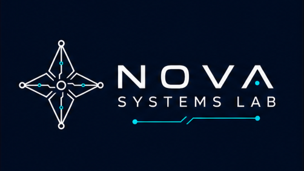

  

# Nova Systems Lab

Nova Systems Lab is an independent open-source software organization focused on systems tools, developer utilities, platform integration, and experimental runtime technologies.

We build projects that explore better ways to work across Windows, Linux, and Android, with an emphasis on:

- clean and maintainable architecture
- security-conscious design
- practical developer tooling
- open technical research
- transparent project governance
- community-driven development

## Projects

### WinDroid Runtime

WinDroid Runtime is an independent Android-compatible runtime and toolkit for Windows.

Its current development path begins with:

- ADB integration
- connected-device management
- APK installation and management
- logging and diagnostics
- native WinUI 3 tooling
- long-term Android runtime and virtualization research

WinDroid Runtime is not a fork or continuation of Microsoft Windows Subsystem for Android.

### WSL Studio

WSL Studio is a planned native Windows desktop application for managing Windows Subsystem for Linux distributions.

Its goals include:

- distribution management
- resource configuration
- startup and shutdown controls
- backup and restore workflows
- networking and storage tools
- logs and diagnostics
- a modern Windows 11 user experience

## Contributing

Contributions are welcome through issues, discussions, forks, and pull requests.

Before starting substantial work:

1. Review the repository README and contribution guide.
2. Check existing issues and discussions.
3. Comment on the issue you would like to work on.
4. Use a focused branch.
5. Open a clear and limited pull request.

Direct repository access is not required to contribute.

## Values

Nova Systems Lab aims to build projects that are:

- open and transparent
- technically responsible
- legally independent
- security-aware
- beginner-friendly
- useful in real-world workflows

## Independence Notice

Nova Systems Lab is an independent open-source organization.

It is not affiliated with, endorsed by, sponsored by, or officially connected to Microsoft, Google, Amazon, Canonical, or any other platform vendor.

All third-party product names and trademarks belong to their respective owners.
